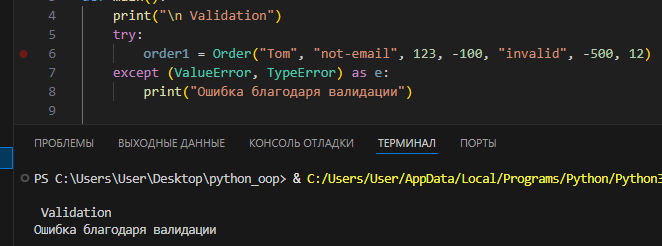
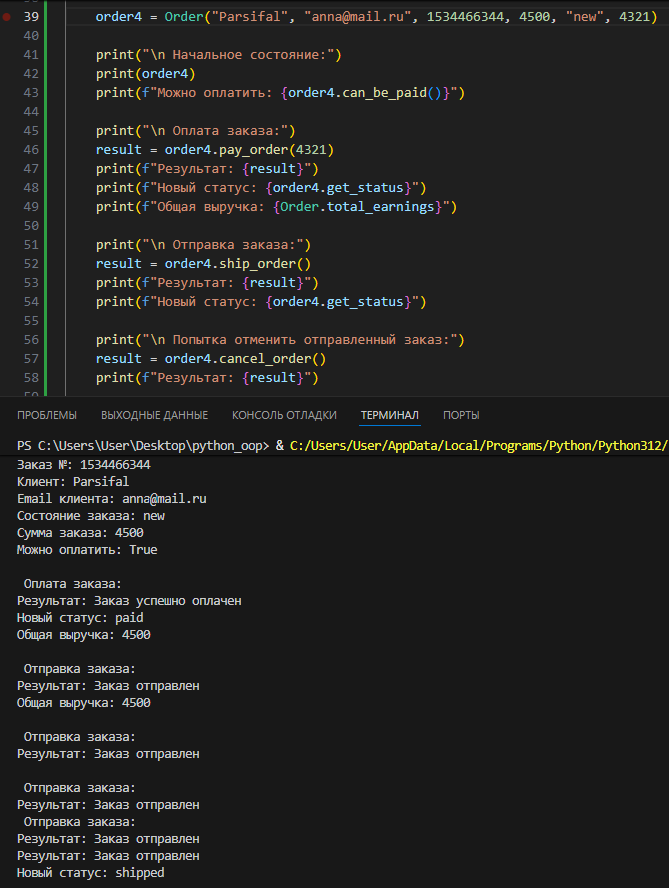
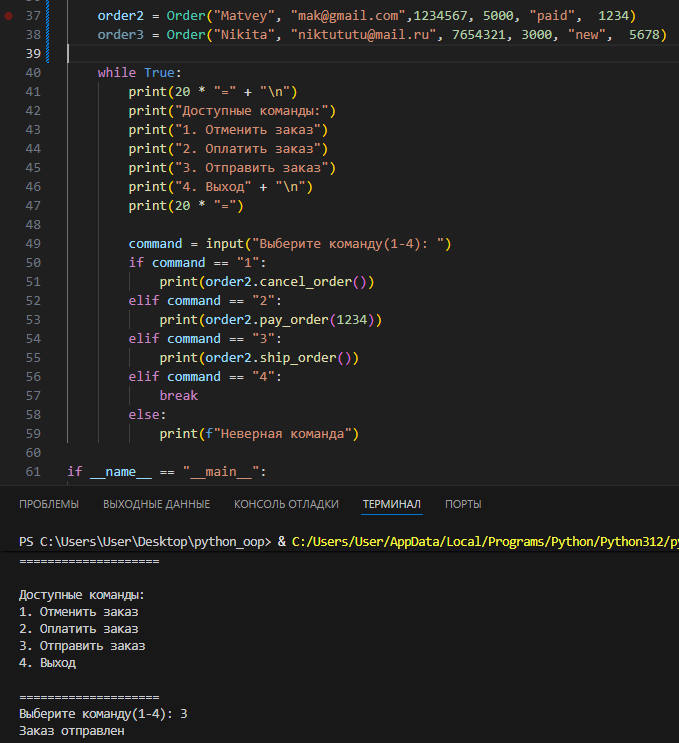
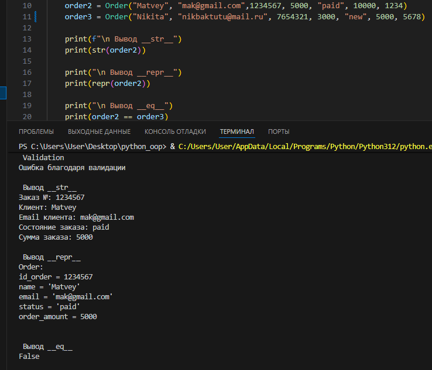

# Отчет по лабораторной работе

## Как создать свой объект

### Вопрос №1. Что является сущностью
В области маркетплейсов или иных серверов доставки существует объект: заказ его мы и будем описывать

### Вопрос №2. Какие атрибуты будут у данного объекта
Для класса Order будут характерны данные атрибуты
* name - имя заказа
* id_order - айди номер заказа
* order_amount - стоимость заказа
* status - статус заказа 

Также для класса Order характерны такие действия как:
1. cancel_order - отмена заказа
2. pay_order - оплата заказа
3. ship_order - отправка заказа

### Вопрос №3. Какие инварианты
Для Order будет характерно:
* id_order не должно быть меньше 6 и больше 20 знаков
* order_amount не может быть меньше 0

### Вопрос №4. Что значит равенство
Для класса Order объекты считаются равными если их id номера равны

### Вопрос №5. Есть ли состояния
У нашего класса есть переменная status которая отвечает за текущее состояние заказа
Например:
Заказ может быть оплачен только если он новый

## Результаты работы класса Order
## Сценарий 1 (перехватываем ошибку с помощью валидации)
В объекте order1 все параметры не соответствуют требованиям валидации из за чего выкидываем ошибку

### Сценарий 2 (жизненный цикл заказа)
Создаем объект order4 и показываем какие изменения с ним происходят

### Сценарий 3 выбираем что будем делать с заказом
Создаем объект order2 и выбираем команду его отправки

## Dunder methods
Магачиские методы для класса Order нужны для красивого вывода пользователю, информативного вывода разработчику и сравнения два обекта

