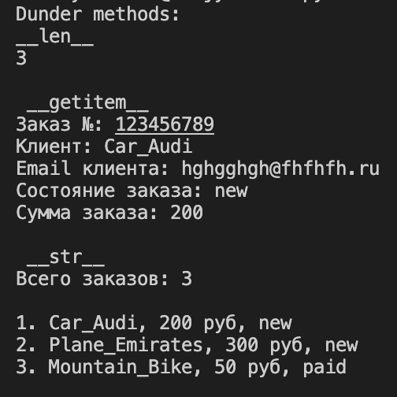
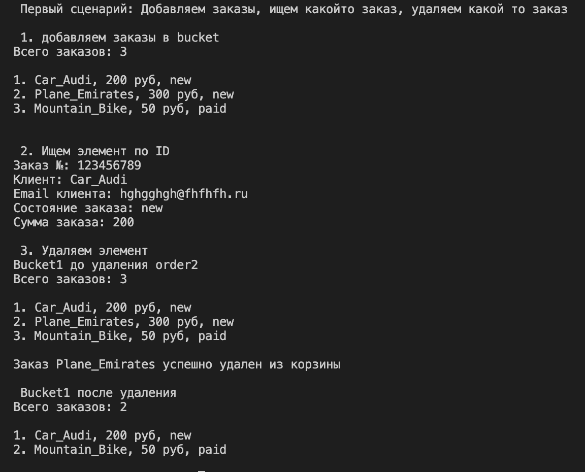
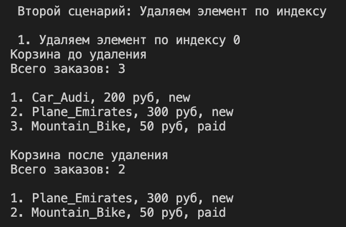
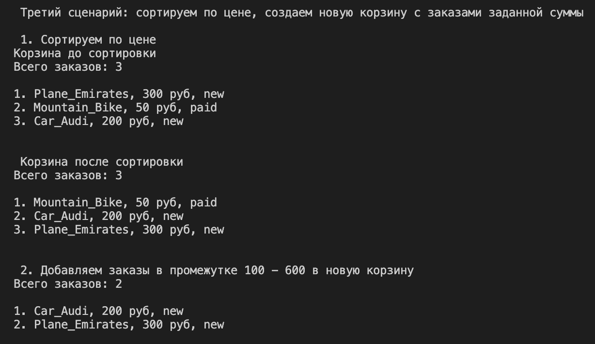

# Отчет по Лаборатороной работе №2
## Dunder methods
* __len__ - метод нужен для отображения количества заказов в корзине
* __iter__ - метод помогает сделать объект итерируемым 
* __getitem__ - метод нужен чтобы возвращать объект по индексу
* __str__ - метод нужен для строкового отображения корзины

## Демонстрация

## Бизнес методы
- add() - добавляет новый объект в корзину
- remove() - удаляет объект из корзины
- get_all() - показывает все заказы из корзины
- find_by_id() - находит заказ в корзине по id
- remove_at_index() - удаляет элемент по индексу
- sort_by_amount() - сортирует заказы в корзине по стоимости
- get_by_amount() - создает новую корзину в которую добавляет заказы которые входят в заданный диапозон

## Сценарий 1

## Сценарий 2

## Сценарий 3
