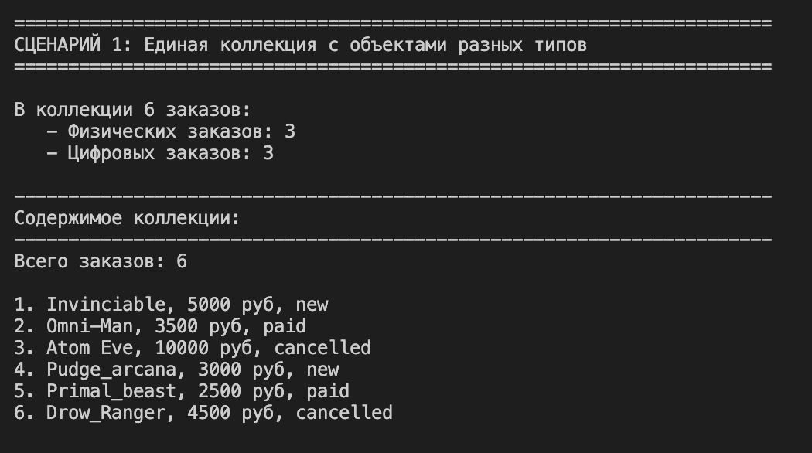
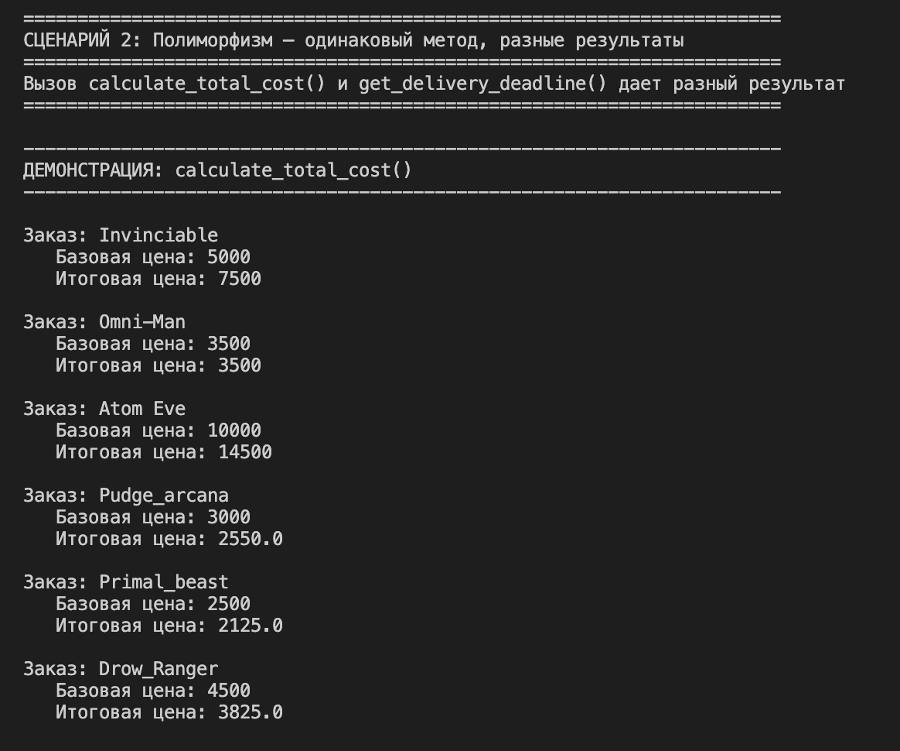
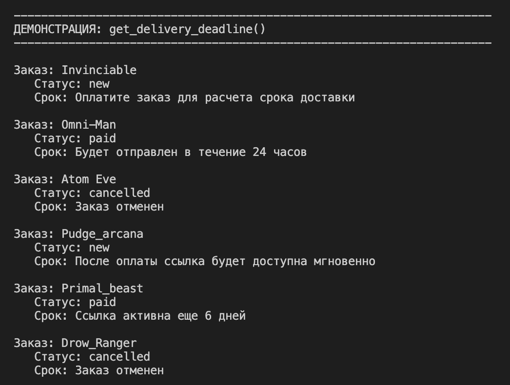
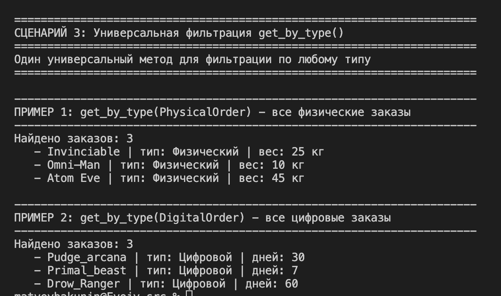

# Отчет по лабораторной работе №3
## Наследование и иерархия классов

---

## 1. Цель работы

Освоить механизм наследования классов, научиться строить иерархию объектов, понять разницу между базовым и производным классами, научиться переиспользовать код и переопределять методы. Изучить принципы полиморфизма и научиться применять их на практике.

---

## 2. Описание реализованной иерархии классов

### Базовый класс - `Order`

Базовый класс `Order` наследуется от `ABC` (Abstract Base Class), что делает его абстрактным. Это означает, что нельзя создать объект класса `Order` напрямую - только через дочерние классы, которые реализуют все абстрактные методы.

**Атрибуты класса:**
- `total_earnings` - общая выручка со всех оплаченных заказов
- `total_orders` - общее количество созданных заказов

**Атрибуты экземпляра:**
- `name` - имя клиента
- `_email` - email клиента (приватный)
- `id_order` - уникальный номер заказа
- `_order_amount` - сумма заказа (приватный)
- `_status` - статус заказа (new, paid, shipped, cancelled)
- `_pin` - пин-код для подтверждения операций

**Абстрактные методы (должны быть реализованы в дочерних классах):**
- `calculate_total_cost()` - расчет общей стоимости заказа
- `get_delivery_deadline()` - получение срока доставки

**Основные методы:**
- `pay_order()` - оплата заказа
- `cancel_order()` - отмена заказа
- `ship_order()` - отправка заказа
- `verify_pin()` - проверка пин-кода
- `can_be_cancelled()`, `can_be_paid()`, `can_be_shipped()` - проверки возможности операций

**Магические методы:**
- `__str__()` - строковое представление заказа
- `__eq__()` - сравнение заказов по id
- `__repr__()` - представление для отладки

---

### Дочерний класс - `PhysicalOrder` (Физический заказ)

Наследуется от `Order` и представляет заказы с физической доставкой.

**Дополнительные атрибуты:**
- `delivery_address` - адрес доставки
- `delivery_weight` - вес заказа (в кг)

**Новые методы:**
- `calculate_shipping()` - расчет стоимости доставки (бесплатно при весе до 20 кг, иначе 100 руб/кг)
- `can_be_returned()` - возможность возврата (только для отправленных заказов)

**Переопределенные методы:**
- `can_be_shipped()` - дополняет родительскую проверку наличием адреса
- `calculate_total_cost()` - сумма заказа + стоимость доставки
- `get_delivery_deadline()` - расчет срока доставки в зависимости от статуса
- `__str__()` - добавляет адрес, вес и стоимость доставки

---

### Дочерний класс - `DigitalOrder` (Цифровой заказ)

Наследуется от `Order` и представляет заказы на цифровые товары.

**Дополнительные атрибуты:**
- `download_link` - ссылка для скачивания
- `expire_days` - срок действия ссылки (в днях)
- `_created_at` - дата создания заказа (приватный)

**Новые методы:**
- `is_valid()` - проверка действительности ссылки
- `generate_download_link()` - генерация ссылки для скачивания

**Переопределенные методы:**
- `pay_order()` - после оплаты генерирует ссылку для скачивания
- `can_be_returned()` - цифровые товары нельзя вернуть (всегда False)
- `calculate_total_cost()` - скидка 15% на цифровые товары
- `get_delivery_deadline()` - информация об активности ссылки
- `__str__()` - добавляет ссылку и срок действия

---

## 3. Демонстрация работы

### Сценарий 1: Единая коллекция с объектами разных типов

---

### Сценарий 2: Полиморфизм - одинаковый метод, разные результаты

---

### Сценарий 3: Универсальная фильтрация `get_by_type()`

---

## 4. Вывод

В ходе выполнения лабораторной работы были изучены и закреплены следующие концепции объектно-ориентированного программирования:

### Наследование
- Создан абстрактный базовый класс `Order` с наследованием от `ABC`
- Реализованы два дочерних класса: `PhysicalOrder` и `DigitalOrder`
- Использован механизм `super()` для вызова конструктора родительского класса
- Достигнуто переиспользование кода базового класса без дублирования
- Добавлены новые атрибуты и методы в дочерние классы

### Полиморфизм
- Переопределены методы базового класса в дочерних (`__str__`, `calculate_total_cost`, `get_delivery_deadline`)
- Реализовано полиморфное поведение без использования проверок `if type == ...`
- Один и тот же метод (`calculate_total_cost()`) дает разные результаты для разных типов заказов
- Создана единая коллекция, которая работает с объектами разных типов через общий интерфейс

