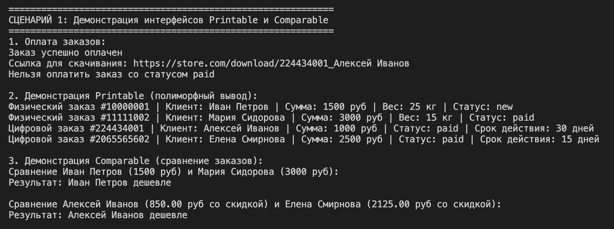
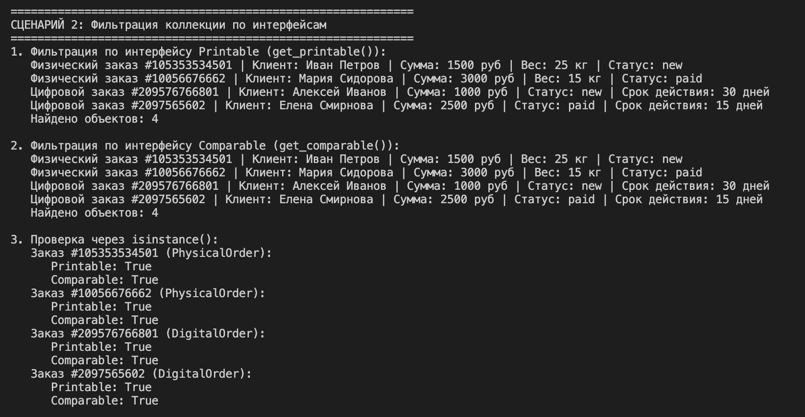
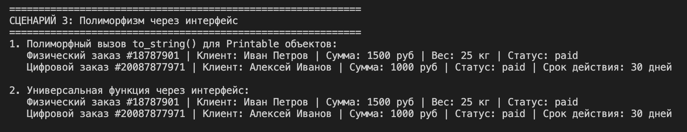

# Отчет по лабораторной работе №5

## 1. Цель работы

Изучение интерфейсов (ABC), абстрактных классов и полиморфизма в Python.

---

## 2. Описание интерфейсов

Создано 2 интерфейса в файле `interfaces.py`:

### Printable
```python
class Printable(ABC):
    @abstractmethod
    def to_string(self) -> str:
        pass
```
Метод: `to_string()` - возвращает строковое представление объекта.

### Comparable
```python
class Comparable(ABC):
    @abstractmethod
    def compare_to(self, other) -> int:
        pass
```
Метод: `compare_to(other)` - сравнивает объекты. Возвращает -1 (меньше), 0 (равно), 1 (больше).

---

## 3. Реализация в классах

Интерфейсы реализованы в двух классах: `PhysicalOrder` и `DigitalOrder`.

| Класс | to_string() | compare_to() |
|-------|-------------|---------------|
| PhysicalOrder | Выводит вес и адрес | Сравнивает по полной сумме |
| DigitalOrder | Выводит срок действия ссылки | Сравнивает по сумме со скидкой 15% |

---

## 4. Демонстрация

### Сценарий 1: Интерфейсы и полиморфизм



---

### Сценарий 2: Фильтрация коллекции по интерфейсам




---

### Сценарий 3: Полиморфизм через интерфейс




---

## 5. Выводы

В ходе работы выполнены следующие задачи:

- Создано 2 интерфейса (Printable, Comparable)
- Реализованы интерфейсы в классах PhysicalOrder и DigitalOrder
- Методы интерфейсов имеют разную реализацию в разных классах
- Коллекция умеет фильтровать объекты по интерфейсам
- Продемонстрирован полиморфизм через интерфейс (без isinstance)

