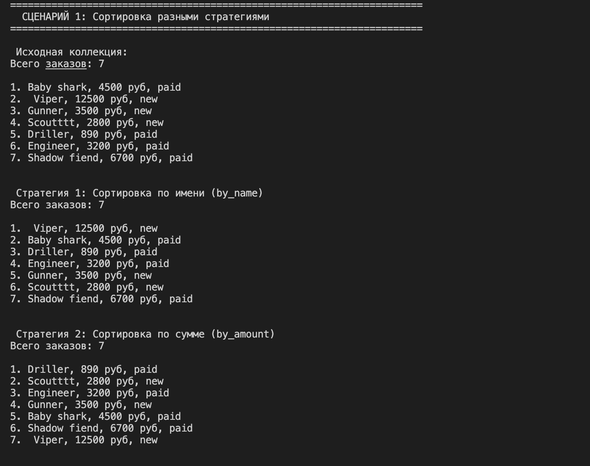
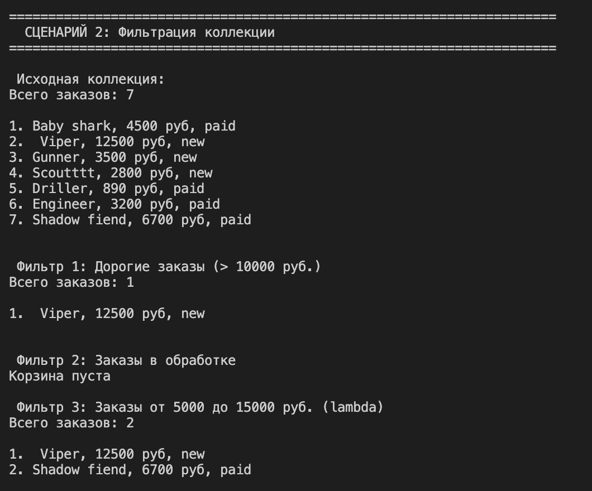
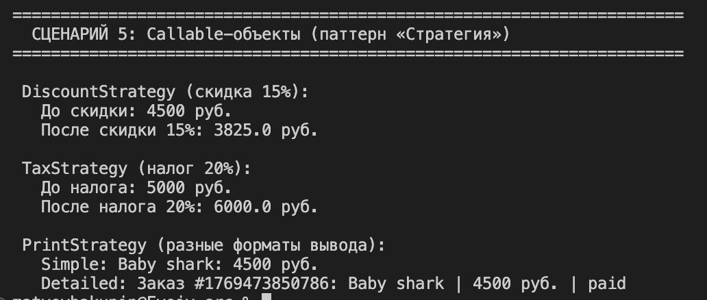

# Отчёт по лабораторной работе №5

## Функции как аргументы. Стратегии и делегаты.

---

## 1. Цель работы

Целью данной лабораторной работы является освоение концепций функционального программирования в Python, а именно:

- **Передача функций как аргументов** в другие функции и методы
- Использование встроенных функций высшего порядка: `map`, `filter`, `sorted`
- Реализация паттерна «Стратегия» на Python
- Создание и применение `lambda`-выражений
- Интеграция функционального стиля с объектно-ориентированным кодом из предыдущих лабораторных работ

Работа построена поверх классов из ЛР-1, ЛР-2 и ЛР-3, где основной моделью предметной области является класс **`Order`** (заказ).

---

## 2. Реализованные функции и стратегии

### 2.1 Функции-стратегии для сортировки

Функции-стратегии — это функции, которые извлекают из объекта значение для сравнения. Они передаются в параметр `key` функций `sorted()`, `min()`, `max()` и методов сортировки коллекции.

В рамках работы реализованы следующие стратегии:

| Функция | Назначение | Пример возврата |
|---------|------------|-----------------|
| `by_name(order)` | Сортировка по имени заказа | `"Пицца 'Ваша печень скажет спасибо'"` |
| `by_amount(order)` | Сортировка по сумме заказа | `4500` |
| `by_status(order)` | Сортировка по статусу | `"готовится"` |
| `by_amount_then_name(order)` | Составная сортировка (сначала по сумме, затем по имени) | `(4500, "Пицца...")` |
| `by_email(order)` | Сортировка по email клиента | `"mario@pizza.it"` |

### 2.2 Функции-фильтры

Функции-фильтры (предикаты) принимают объект и возвращают `True` (оставить элемент) или `False` (исключить). Они используются с функцией `filter()`.

| Функция | Назначение | Условие |
|---------|------------|---------|
| `is_expensive(order)` | Дорогие заказы | `order.amount > 10000` |
| `is_cheap(order)` | Дешёвые заказы | `order.amount < 2000` |
| `is_in_progress(order)` | Заказы в обработке | `status in ["готовится", "в обработке"]` |
| `is_completed(order)` | Завершённые заказы | `status in ["завершён", "доставлен"]` |

### 2.3 Функции высшего порядка

В работе используются следующие встроенные функции высшего порядка:

| Функция | Назначение | Пример |
|---------|------------|--------|
| `sorted()` | Сортировка коллекции | `sorted(orders, key=by_amount)` |
| `filter()` | Фильтрация коллекции | `list(filter(is_expensive, orders))` |
| `map()` | Преобразование коллекции | `list(map(lambda o: o.name, orders))` |

### 2.4 Фабрика функций

Фабрика функций — это функция, которая создаёт и возвращает другую функцию, "запоминая" переданные параметры через механизм замыкания (closure).

### 2.5 Паттерн «Стратегия» через callable-объекты (оценка 5)

**Паттерн «Стратегия»** определяет семейство алгоритмов, инкапсулирует каждый из них и делает их взаимозаменяемыми. В реализации используются **callable-объекты** — объекты классов с методом `__call__`, которые можно вызывать как функции.

**Преимущества callable-объектов перед обычными функциями:**
- Могут хранить состояние между вызовами
- Можно настраивать после создания
- Легко расширять дополнительными методами

### 2.6 Методы класса коллекции

В класс `BucketOrder` добавлены методы для функциональной обработки:

| Метод | Назначение | Возврат |
|-------|------------|---------|
| `sort_by(key_func)` | Сортировка по стратегии | `self` (для цепочек) |
| `filter_by(predicate)` | Фильтрация по предикату | `self` |
| `apply(func)` | Применение функции ко всем элементам | `self` |
| `map_to(func)` | Преобразование в новый список | `list` |
| `copy()` | Создание копии коллекции | `BucketOrder` |

---

## 3. Демонстрация работы

### Сценарий 1: Сортировка разными стратегиями

### Сценарий 2: Фильтрация коллекции

### Сценарий 3: Преобразование через map() и фабрики функций

### Сценарий 4: Цепочка операций

### Сценарий 5: Callable-объекты (паттерн Стратегия)

## 4. Вывод

В ходе выполнения лабораторной работы были изучены следующие концепции:

- **Передача функций как аргументов** — функции в Python являются объектами первого класса, их можно передавать в другие функции как ссылки, без вызова, что позволяет создавать гибкие и переиспользуемые алгоритмы.

- **Lambda-выражения** — анонимные функции, удобные для простых одноразовых операций фильтрации, сортировки и преобразования данных.

- **Функции высшего порядка** — использование `map()`, `filter()` и `sorted()` для функциональной обработки коллекций вместо явных циклов.

- **Замыкания и фабрики функций** — механизм, позволяющий функции "запоминать" параметры и создавать специализированные функции на основе общего шаблона.

- **Паттерн «Стратегия»** — выделение алгоритмов в отдельные функции или callable-объекты, делая их взаимозаменяемыми и позволяя изменять поведение программы без изменения основного кода.

- **Callable-объекты** — объекты классов с методом `__call__`, которые можно вызывать как функции; они могут хранить состояние, накапливать статистику и иметь дополнительные методы.

- **Fluent Interface (цепочки операций)** — метод возвращает `self`, что позволяет выстраивать последовательные операции в удобочитаемой форме.