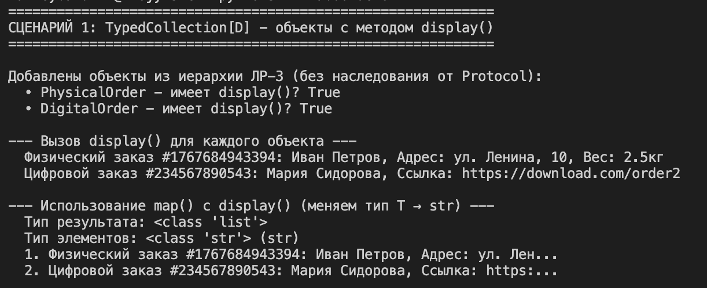
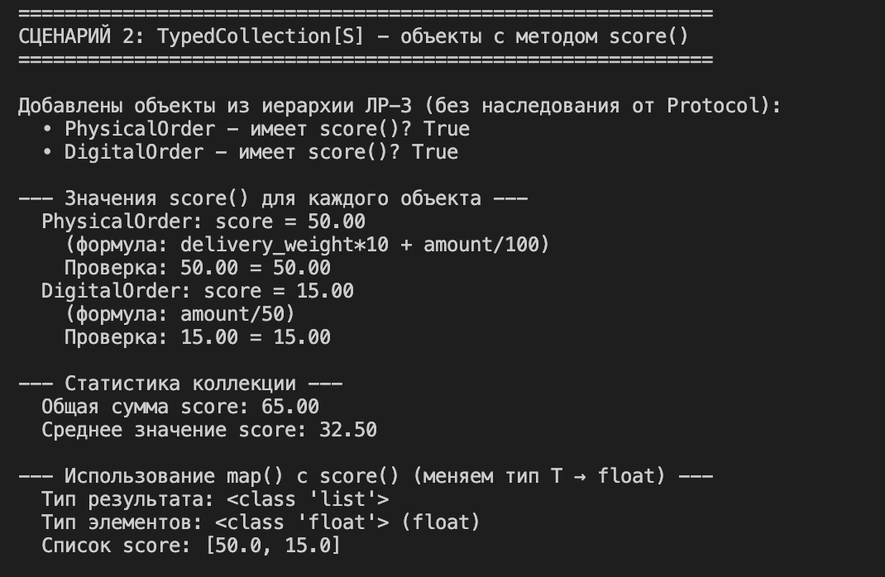

# Отчет по лабораторной работе №6
## Типизация в Python: Generics, Protocols и аннотации типов

---

## 1. Цель работы

Цель лабораторной работы — освоить продвинутые возможности типизации в Python:
- Добавление аннотаций типов к существующим классам
- Создание Generic-коллекций с использованием `TypeVar`
- Реализация структурных интерфейсов через `Protocol`
- Применение функций высшего порядка (`find`, `filter`, `map`) с типизированными коллекциями

---

## 2. Описание реализованных типов и контейнеров

### 2.1. Generic-класс TypedCollection

Реализован универсальный класс-контейнер `TypedCollection`, который может хранить элементы любого типа с сохранением типовой информации.

**Основные TypeVar:**

T = TypeVar('T')  # Тип элементов коллекции
R = TypeVar('R')  # Тип результата преобразования (для map)

**Методы коллекции:**
- `add(item: T) -> None` — добавление элемента
- `remove(item: T) -> None` — удаление элемента
- `get_all() -> List[T]` — получение всех элементов
- `find(predicate: Callable[[T], bool]) -> Optional[T]` — поиск элемента по условию
- `filter(predicate: Callable[[T], bool]) -> List[T]` — фильтрация элементов
- `map(transform: Callable[[T], R]) -> List[R]` — преобразование элементов с изменением типа

**TypeVar с ограничениями:**

D = TypeVar('D', bound=Displayable)  # Только объекты с методом display()
S = TypeVar('S', bound=Scorable)     # Только объекты с методом score()

---

## 3. Демонстрация работы

### Сценарий 1: TypedCollection[D] с Displayable

### Сценарий 2: TypedCollection[S] с Scorable

## 4. Вывод

В ходе выполнения лабораторной работы были изучены и применены на практике:

### 4.1. Аннотации типов
- Добавлены аннотации для всех параметров методов и атрибутов классов
- Аннотации помогают IDE и статическим анализаторам (mypy) находить ошибки на этапе написания кода
- Код становится самодокументируемым — по аннотации понятно, какой тип ожидается

### 4.2. Generic и TypeVar
- Реализован параметризованный класс `TypedCollection[T]`, который может работать с любым типом данных
- `TypeVar` позволяет создавать гибкие, но типобезопасные интерфейсы
- В методе `map` используется два разных `TypeVar` (`T` и `R`), что демонстрирует изменение типа результата

### 4.3. Protocol как структурный интерфейс
- Protocols реализуют принцип "утиной типизации" (duck typing) на уровне статической проверки
- Класс соответствует протоколу, если у него есть нужные методы, даже без явного наследования
- `@runtime_checkable` позволяет использовать `isinstance()` для проверки соответствия протоколу

### 4.4. Практическая польза типизации
- **Читаемость:** Аннотации служат документацией, показывая ожидаемые типы
- **Поддерживаемость:** При изменении кода ошибки типов находятся компилятором/IDE
- **Безопасность:** Предотвращает ошибки, связанные с передачей объектов неправильного типа
- **Инструменты:** Статические анализаторы (mypy, pyright) могут проверять корректность типов

### 4.5. Итог
Лабораторная работа позволила освоить современные возможности типизации Python, которые активно используются в крупных проектах и являются стандартом индустрии. Особенно важным является понимание `Protocol` как альтернативы наследованию — это позволяет создавать гибкие интерфейсы без жесткой привязки к иерархии классов.