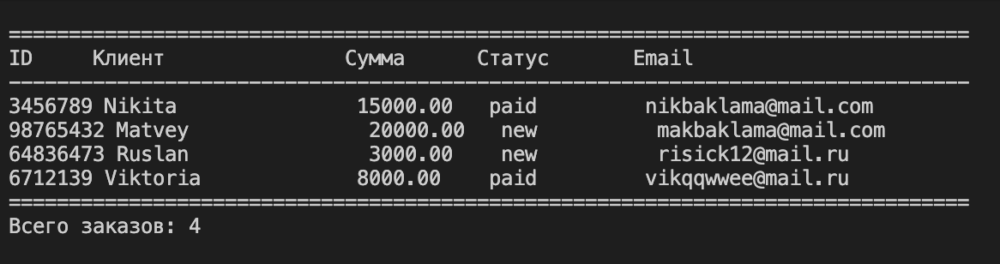
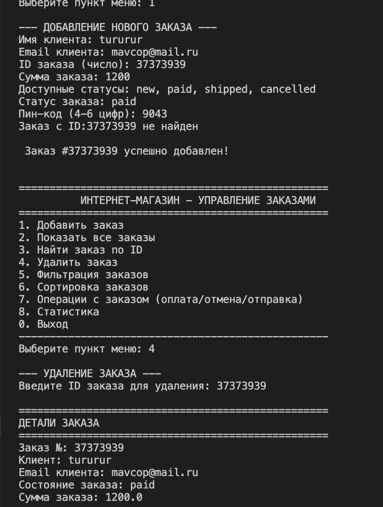
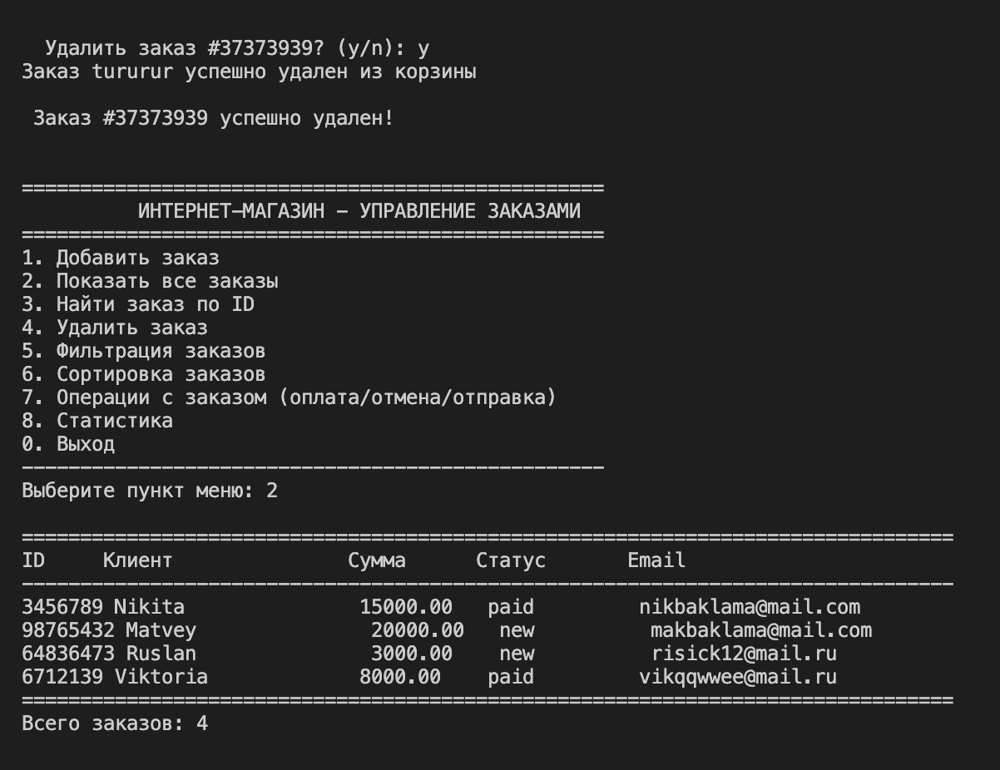
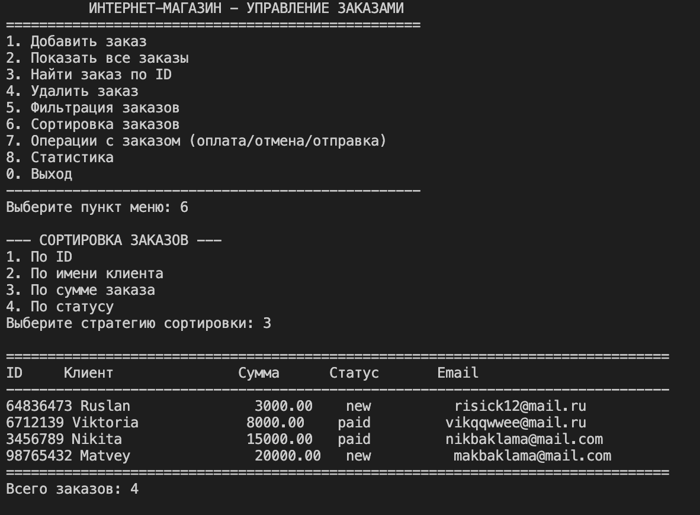
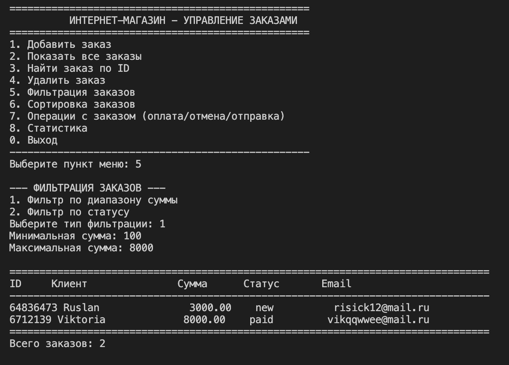
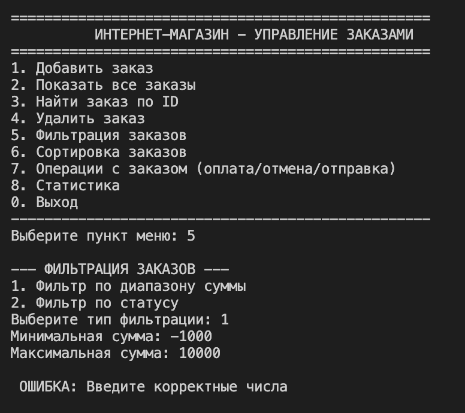

# Отчет по лабораторной работе №7
---

## 1. Цель работы

Объединить знания, полученные в лабораторных работах №1-6, в единое работающее приложение с интерактивным CLI-интерфейсом.

**Реализовано:**
- Полноценное консольное приложение для управления заказами интернет-магазина
- Интерактивное меню с 9 пунктами (8 операций + выход)
- Полный CRUD функционал (создание, чтение, обновление, удаление)
- Фильтрация и сортировка заказов
- Сохранение и загрузка данных в JSON-формате
- Обработка ошибок и собственные исключения

**Примененные навыки:**
- Разбиение кода на модули и слои (CLI, бизнес-логика, хранение данных)
- Работа с классами и объектами Python
- Паттерн «Стратегия» для сортировки и фильтрации
- Обработка исключений (try-except, собственные исключения)
- Типизация и docstring
- Работа с JSON-файлами

---


### Назначение файлов:

| Файл | Отвечает за | Основные функции |
|------|-------------|------------------|
| **main.py** | Точка входа, инициализация | Загрузка данных при старте, запуск CLI, сохранение при выходе |
| **cli.py** | Пользовательский интерфейс | Отображение меню, ввод данных, вывод результатов, форматирование таблиц |
| **app.py** | Бизнес-логика | Добавление, удаление, поиск, фильтрация, сортировка, операции с заказами |
| **storage.py** | Хранение данных | Сохранение коллекции в JSON, загрузка из JSON |
| **exceptions.py** | Обработка ошибок | Собственные исключения для предметной области |
| **models.py** (lab01/lab02) | Модели данных | Классы Order (заказ) и BucketOrder (коллекция) |

### Слои архитектуры:

1. **Уровень представления (CLI)** - `cli.py`
   - Только ввод/вывод, никакой бизнес-логики
   - Форматирование вывода в виде таблиц
   - Обработка пользовательского ввода

2. **Уровень бизнес-логики** - `app.py`
   - Все операции над коллекцией заказов
   - Валидация данных
   - Вызов методов моделей

3. **Уровень хранения данных** - `storage.py`
   - Сериализация/десериализация в JSON
   - Работа с файловой системой

4. **Уровень моделей** - `lab01/model.py`, `lab02/bucket.py`
   - Классы предметной области
   - Методы для работы с заказами

---

## 2. Описание CLI

### Пункты меню

```
==================================================
          ИНТЕРНЕТ-МАГАЗИН - УПРАВЛЕНИЕ ЗАКАЗАМИ
==================================================
1. Добавить заказ
2. Показать все заказы
3. Найти заказ по ID
4. Удалить заказ
5. Фильтрация заказов
6. Сортировка заказов
7. Операции с заказом (оплата/отмена/отправка)
8. Статистика
0. Выход
--------------------------------------------------
```

### Обработка ошибок ввода

| Тип ошибки | Пример | Обработка |
|------------|--------|-----------|
| Ввод текста вместо числа | Ввод "abc" в пункте меню | `ValueError` → сообщение "Введите число" |
| Отрицательная сумма заказа | Сумма: -100 | Валидация → "Сумма должна быть положительной" |
| Некорректный пин-код | Пин: "abc" | Валидация → "Пин-код должен быть числом" |
| Дубликат ID | Добавление заказа с существующим ID | `DuplicateOrderException` → "Заказ с ID X уже существует" |
| Заказ не найден | Поиск/удаление несуществующего ID | `OrderNotFoundException` → "Заказ не найден" |
| Некорректный статус | Статус: "invalid" | Валидация → "Доступные статусы: new, paid, shipped, cancelled" |
| Отрицательная сумма в фильтре | Min: -1000 | Валидация → "Сумма не может быть отрицательной" |


## 4. Демонстрация работы

### Сценарий 1: Запуск → автозагрузка → вывод коллекции




## Сценарий 2: Удаление






### Сценарий 3: Сортировка с выбором стратегии



### Сценарий 4: Фильтрация + перехват исключений







## 5. Вывод

В ходе выполнения лабораторной работы были изучены и применены:

### Разбиение на модули и слои
- **Четкое разделение ответственности**: CLI отвечает только за ввод/вывод, бизнес-логика изолирована в app.py, хранение данных в storage.py
- **Слабая связанность**: Изменение интерфейса не требует изменения бизнес-логики
- **Повторное использование кода**: Модели из ЛР1-2 используются без изменений

### CLI-интерфейс
- Создание интерактивного консольного приложения с циклическим меню
- Форматированный вывод данных в виде таблиц
- Валидация пользовательского ввода на всех этапах
- Подтверждение опасных операций (удаление, выход)

### Обработка исключений
- **Собственные исключения**: `OrderNotFoundException`, `DuplicateOrderException`
- Перехват стандартных исключений: `ValueError`, `TypeError`, `KeyError`
- Пользовательские сообщения об ошибках на русском языке
- Graceful degradation - приложение не падает при ошибках

